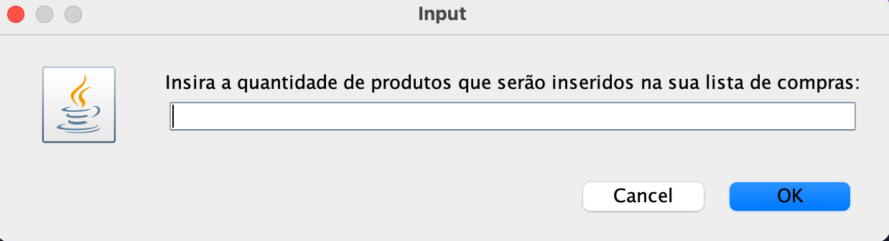
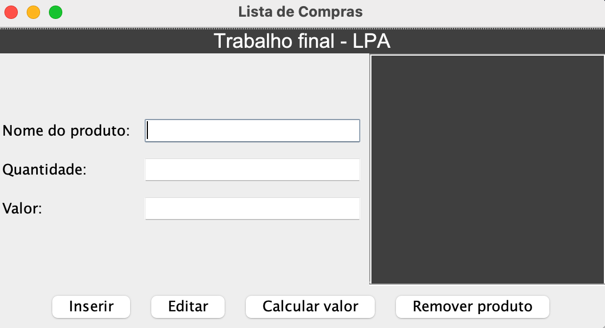
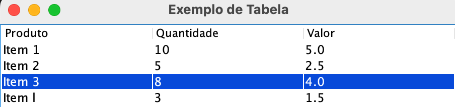

# TRABALHO FINAL 📚

Proponha as seguintes modificações:

* Altere a proposta de armazenamento das informações na matriz e faça implementações condizentes ao tema escolhido.

* Crie novas funcionalidades além das que já existem. As funcionalidades novas devem ser essenciais para resolução do problema. Caso nenhuma funcionalidade seja criada o trabalho será desconsiderado.

* Será necessário fazer a validação de todas as interações do usuário.

* A implementação deverá ser feita individualmente.

* O trabalho deverá estar disponível em um repositório público no GitHub.


```java
import java.util.Scanner;

public class ListaProdutos {

	public static void inserirProdutos(String[][] matriz, int linhas, int colunas) {
		Scanner scanner = new Scanner(System.in);
		int linha;

		mostrarProdutos(matriz, linhas, colunas);
		do {
			System.out.println("Informe onde você deseja inserir o produto com valores de 1 à " + linhas);
			linha = scanner.nextInt();
		} while (linha < 1 || linha > linhas);

		System.out.println("Insira o nome do produto: ");
		matriz[linha - 1][0] = scanner.next();
		System.out.println("Insira a quantidade de produtos: ");
		matriz[linha - 1][1] = scanner.next();
		System.out.println("Insira o valor do produto: ");
		matriz[linha - 1][2] = scanner.next();
		System.out.println("Produto adicionado.");
	}

	public static void mostrarProdutos(String[][] matriz, int linhas, int colunas) {
		Scanner scanner = new Scanner(System.in);
		System.out.println("Produto | Quantidade | Valor");
		for (int i = 0; i < linhas; i++) {
			System.out.print((i + 1) + " - ");
			for (int j = 0; j < colunas; j++) {
				System.out.print(matriz[i][j] + " | ");

			}
			System.out.println();
		}
	}

	public static void calcularValor(String[][] matriz, int linhas) {
		Scanner scanner = new Scanner(System.in);
		Float valorFinal = 0.0f;
		for (int i = 0; i < linhas; i++) {
			if (matriz[i][0] != null) {
				valorFinal = valorFinal + Float.parseFloat(matriz[i][1]) * Float.parseFloat(matriz[i][2]);
			}
		}
		System.out.println("Valor final da lista de compras: " + valorFinal + " R$");
	}

	public static void removerProduto(String[][] matriz, int linhas, String nomeProduto) {
		boolean encontrado = false;
		for (int i = 0; i < linhas; i++) {
			if (matriz[i][0] != null && matriz[i][0].equals(nomeProduto)) {
				encontrado = true;
				matriz[i][0] = null;
				matriz[i][1] = null;
				matriz[i][2] = null;
			}
		}
		if (encontrado) { // if (encontrado == true) {
			System.out.println("Produto removido.");
		} else {
			System.out.println("Produto não encontrado.");
		}
	}

	public static void main(String[] args) {
		String[][] lista;
		int produtos, opcao;
		int colunas = 3;
		Scanner scanner = new Scanner(System.in);
		String nomeProduto;

		System.out.println("Insira a quantidade de produtos que serão inseridos na sua lista de compras:");
		produtos = scanner.nextInt();
		lista = new String[produtos][colunas];

		do {
			System.out.println(
					"Escolha uma opção: \n 1 - Mostrar lista de compras. \n 2 - Inserir produtos na lista de compras. \n 3 - Calcular valor dos produtos da lista de compras. \n 4 - Remover produto da lista de compras. \n 0 - Sair.");
			opcao = scanner.nextInt();
			switch (opcao) {
			case 0:
				break;
			case 1:
				mostrarProdutos(lista, produtos, colunas);
				break;
			case 2:
				inserirProdutos(lista, produtos, colunas);
				break;
			case 3:
				calcularValor(lista, produtos);
				break;
			case 4:
				System.out.println("Insira o produto a ser removido.");
				nomeProduto = scanner.next();
				removerProduto(lista, produtos, nomeProduto);
				break;
			default:
				System.out.println("Opção inválida!");
			}
		} while (opcao != 0);
	}
}
```

# O que eu fiz ✅

* Melhorar o visual do programa
* Tornar a interatividade com o usuário muito melhor
* Opção para editar qualquer registro 
* Validação de todos os campos, nos campos da quantidade e do valor só aceita números e no campo da produto aceita números e caracteres, ele é alfanumérico.

* Eu respeitei o código implementado pelo professor, toda lógica foi mantida mas tive que fazer algumas alterações

* Botão imprimir, para gerar um ficheiro txt com tudo que está no textarea.

# Futuras ideias 🔮

* Criação de um campo categoria
* Botão pesquisar, ao editar um produto ele meio que pesquisa então não tenho tanta certeza se quero implementar (talvez um dia!)


# Telas 💻



**Descrição:** Ao executar o programa vai aparecer essa tela, no exemplo do professor ele pede para citar o número de linhas, eu quis usar um ArrayList para ele não ter que sempre perguntar isso, eu quis que ele tivesse n linhas, mas tive medo de se afastar muito daquilo que o professor quer então mantive a ideia só que deixei ela com validação no campo, só aceita números inteiros, se você colocar 0 não dará para inserir um valor, o programa vai avisar que excederam o número de linhas 

<br>



Para se aproximar de um terminal eu usei um textarea, assim ele vai aparecer no mesmo estilo do CLI.

Como outra opção eu poderia usar o JTable e preencher todos os dados nele.

Ex:


**Inserir:** no botão inserir ele armazena os dados no textarea (nome, qtd e valor).

**Editar:** no botão editar ele primeiro vai pedir para digitar o nome do produto que deseja editar, o programa vai pesquisar na matriz se existe tal produto para poder editar, depois vai aparecer uma nova janela para então reescrever o produto.

<b>Obs: Atenção que produto em mínuscula difere de produto com maiúscula ⚠️</b>

**Calcular valor:** no botão calcular valor ele vai pegar a qtd e multiplicar ela pelo valor, depois vai somar com todos os outros produtos.

**Remover produto:** no botão remover produto ele primeiro vai pedir para digitar o nome do produto que deseja remover, o programa vai pesquisar na matriz se existe tal produto para poder remover, depois virá um aviso de produto removido.

# Ficheiro executável 🗳️:

<a href="https://github.com/Korzre/trabalho-final-lpa/releases/tag/trabalho-lpa-package">
<i>Faça o download da versão executável do projeto<i>
<br>


</a>


# Ferramentas utilizadas 🛠️:

<center>
<a href="https://www.eclipse.org/downloads/">

Eclipse
</a>

</center>